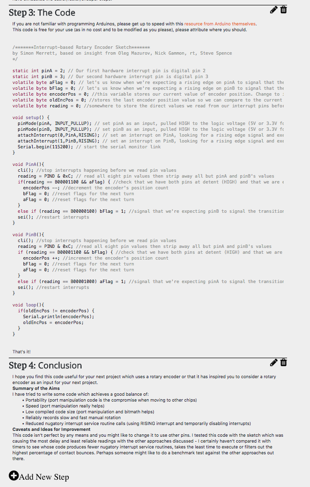
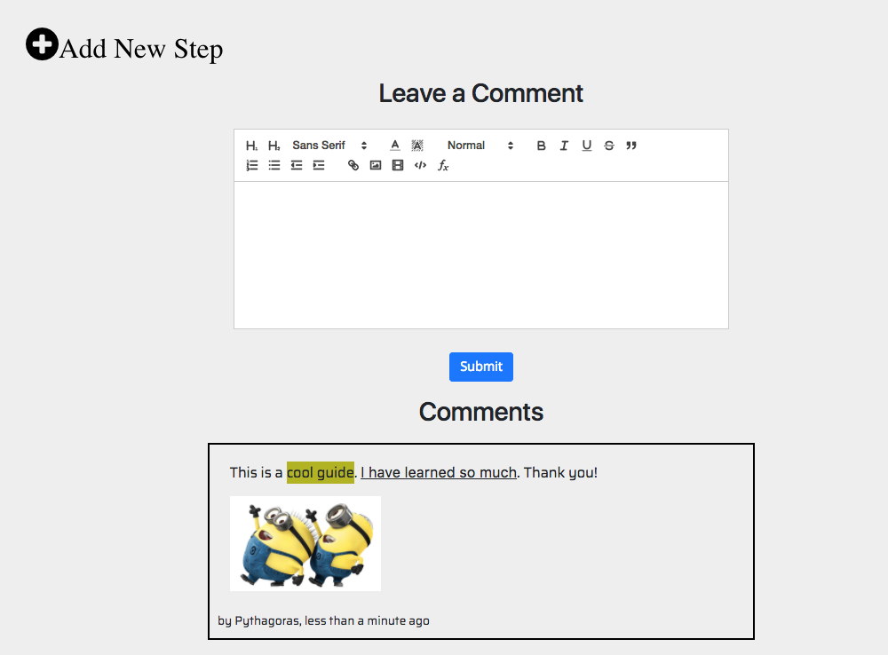
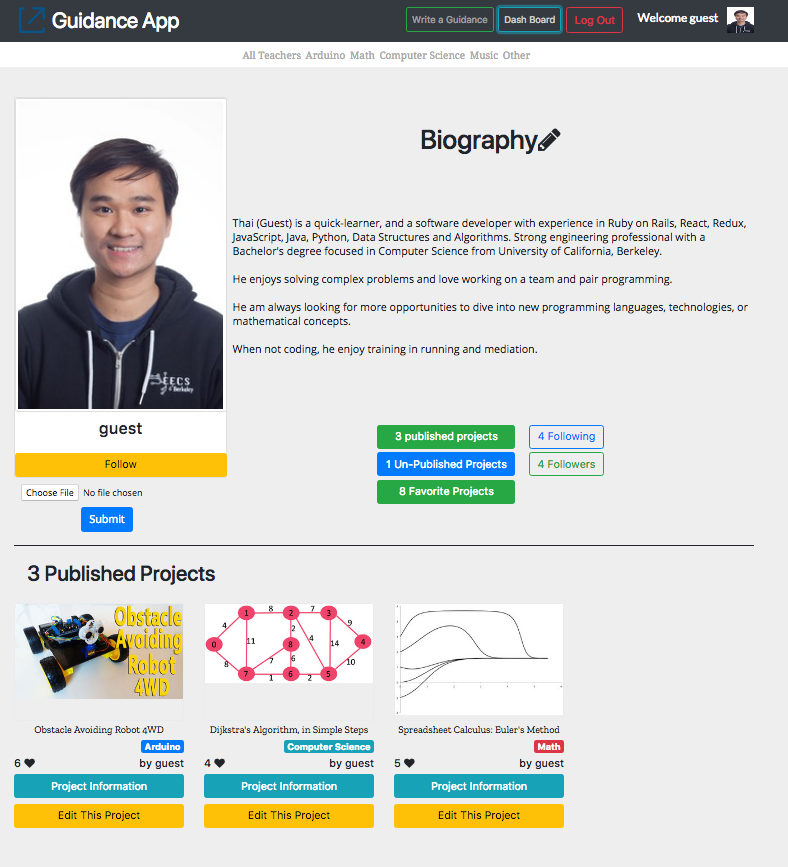

## Features of a great production readme:
- **[Guidance](https://guidance-app.herokuapp.com/#/)**, a [Instructables](https://www.instructables.com/) clone, is a social media application that allows users to explore, share their work, learn and make anything by following the steps of guidance

- [Guidance App live](https://guidance-app.herokuapp.com/#/)

- Demo:


### Technologies Used
- Ruby on Rails v5.1.4
- PostgreSQL
- React.js
  - React Hash Router
  - React Quill
  - React Scroll
- Redux
  - Redux Thunk
- Amazon Web Services (AWS)
- Paperclip
- Webpack
- Babel
- Sass
- Bootstrap


### Feature & Implementation
#### User (teacher)
- Secure user accounts, using **front-end and back-end (API)** user authentication using **BCrypt**.
- User can **upload** their profile picture.
- User can **follow** other users.

#### Guidance (project)
- User has the ability to **create/edit** guides (projects).
- User can **add photo/images and embed youtube video** in the guides.
- User can **pulished and unplished** their own projects.
- User can **like** others' pulished guidances.

#### Step
- For each guide, user has ability to add or create **steps**. They also able to edit and delete step as well.
- Steps are displayed in order.
- User can **add images and embed youtube videos** in each step. They also add **paragraphs**, **syntax/code**, **formula/function** using rich text editor.

#### Comment
- User can comment on the **published guides**.

#### Search
- User can search for any guides and other users by keyword

#### Taggings
- User can add tag to their guides
- Each project has tags on it


----------
## Steps
- Each **step** created in Guidance is saved in a `Steps` table the database, which holds each author_id, title, description, updated_at. The current user has the ability to create `new` **step**, `edit`, and `delete` their existing notes using a rich text editor that I implemented using React Quill.
- As Guidanceis predominatly a single-page app, the majority of my components were all rendered in my overaching Notes Container. this is illustrated below in the render function of my Notes Container:

```ruby
<div className="project-show-page">
 <div className="project-show-buttons">
   <div className="project-show-buttons-user-info">
     <Link
       className="project-show-back-to-index"
       to={`/users/${user.id}`}
     >
       <i className="fa fa-user fa-2x" />
     </Link>

     {displayLike()}
   </div>

   <div className="project-show-button-user-project">
     <div>{this.displayButton('edit', user.id)}</div>
     <div>{this.displayPublish(user.id, publishedText)}</div>
   </div>
 </div>

 <div className="project-show">
   <h1 className="project-show-title">{project.title}</h1>
   
 </div>

 <div className="project-show-description">
   <span>Description</span>
   <div
     className="ql-editor"
     dangerouslySetInnerHTML={{ __html: project.description }}
   />
 </div>

 <div className={`project-show-video ${hideVideo}`}>
   <span>Guidance Video</span>
   <iframe src={project.video_url} frameBorder="0" allowFullScreen />
 </div>

 <div>
   {steps.map((step, i) => (
     <StepItem
       key={step.id + uniqueId()}
       step={step}
       projectId={project.id}
       count={parseInt(i + 1)}
       author={user}
       currentUser={this.props.currentUser}
       removeStep={this.props.removeStep}
     />
   ))}
 </div>

 <div>{this.displayButton('new', user.id)}</div>

 <CommentShowContainer />
</div>
```

- This is resulted in a signle-page app with mutiple modals and sliding components, picture below:






------
## DashBoard

- Each user has their own dashboard to see the overview of
  - Published Guides.
  - Un-published Guides.
  - Their favorite guides that they like.
  - People they are following.
  - People who follow them.
- User can see other users dashboard, not his/her un-published guides.




------

### Future Directions for the Project

#### Guides Sort By
- Currently, a user's guides can only be shown in the order of when a note was last updated at. I plan to allow users the capability of sorting their guides by date created, date update uploaded, and guide title. With this filtering capability, users will given more control of how they prefer their notes to be organized and will greatly increase their user experience.


#### classes
- Guides can be classified into different group like classes (Math, Computer Science, Music, ...)


#### Enrolled
- If a guide is to big, it might be considered to turn into a class, so that user can enrolled in the class they want
